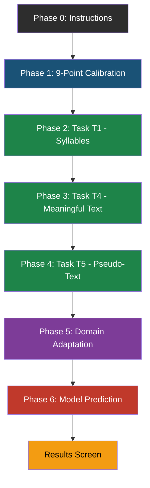
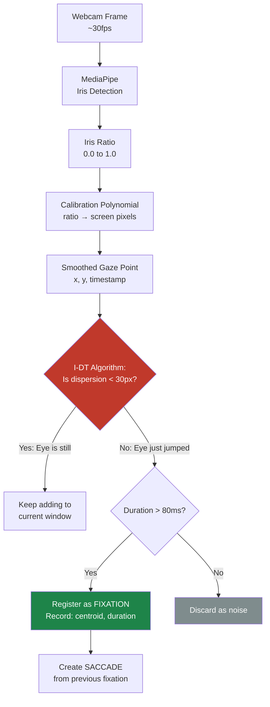
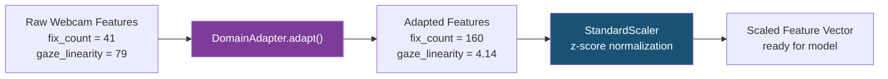
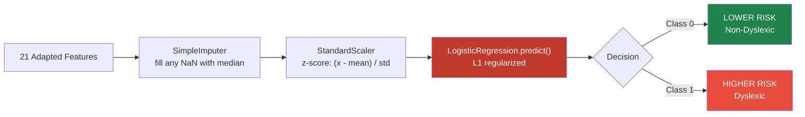
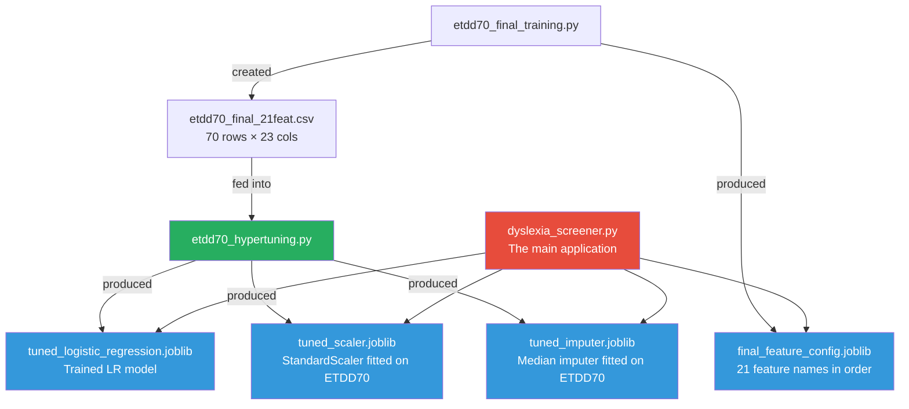

# Dyslexia Screener — Complete Pipeline Flow

## High-Level Architecture



---

## Detailed Step-by-Step Flow

### Phase 0 — Startup & Model Loading
```
User runs: python dyslexia_screener.py
    |
    v
DyslexiaScreener.__init__()
    |
    ├── Opens webcam (cv2.VideoCapture)
    ├── Loads tuned_logistic_regression.joblib  <-- The trained ML model
    ├── Loads tuned_scaler.joblib               <-- StandardScaler (z-score normalizer)
    ├── Loads tuned_imputer.joblib              <-- Fills missing values
    └── Loads final_feature_config.joblib       <-- List of 21 feature names in exact order
```

### Phase 1 — 9-Point Calibration

> [!IMPORTANT]
> This phase creates the mathematical bridge between "where your iris is pointing" and "where on the screen you're looking."


**What happens per calibration point:**
1. A yellow dot appears at a known screen position (e.g., `(153, 86)`)
2. The webcam captures your face at 30fps for 2 seconds
3. MediaPipe detects 478 facial landmarks, including iris centers (indices 468 & 473)
4. For each frame, the code computes:
   - `iris_ratio_x = (iris_center_x - eye_corner_left) / eye_width` → value between 0 and 1
   - `iris_ratio_y = (iris_center_y - eye_top) / eye_height` → value between 0 and 1
5. These ratios are averaged across both eyes and across all frames
6. The result is stored: *"When user looks at screen pixel (153, 86), their iris ratio is (0.52, 0.47)"*
7. After all 9 points, a **2nd-degree polynomial** is fitted:
   - `screen_x = a·rx² + b·ry² + c·rx·ry + d·rx + e·ry + f`
   - `screen_y = ...` (same form, different coefficients)

---

### Phases 2-4 — Reading Tasks (The Core Data Collection)



**Per-frame loop (runs ~30 times per second):**
1. Read webcam frame
2. MediaPipe detects iris position → compute iris ratio
3. Polynomial maps ratio → estimated screen (x, y) pixel
4. Apply moving average smoothing (window=15 frames)
5. Feed smoothed point into **I-DT Fixation Detector**

**I-DT (Identification by Dispersion Threshold) algorithm:**
- Maintains a growing "window" of recent gaze points
- Computes dispersion = `(max_x - min_x) + (max_y - min_y)`
- If dispersion ≤ 30px → "eye is still here, keep watching"
- If dispersion > 30px → "eye just jumped away!"
  - Check if the accumulated window lasted ≥ 80ms
  - If yes → **FIXATION** recorded (centroid x,y + start/end timestamps)
  - If no → discarded as noise/jitter
- A **SACCADE** is created between every consecutive pair of fixations

**After user presses SPACE (done reading):**
- `finalize()` captures any remaining in-progress fixation
- Feature extraction begins for that task

---

### Feature Extraction (Per Task)

From the list of fixations and saccades, 7 features are computed:

| Feature | How It's Computed | What It Measures |
|---------|-------------------|------------------|
| `fix_count` | `len(fixations)` | Reading effort |
| `fix_dur_mean` | `mean(all fixation durations)` | Processing difficulty |
| `fix_dur_sd` | `std(all fixation durations)` | Reading erraticness |
| `fix_dur_median` | `median(all fixation durations)` | Typical fixation length |
| `total_read_time` | `last_fixation.end - first_fixation.start` | Overall reading speed |
| `gaze_linearity` | `mean(abs(y_diff between consecutive fixations))` | Vertical jumping |
| `revisit_count` | Count of fixations landing on a previously-visited line ROI | Re-reading behavior |

This produces **7 features × 3 tasks = 21 features total**.

---

### Phase 5 — Domain Adaptation

> [!WARNING]
> This is the critical bridge between webcam and lab data. Without it, every user appears "dyslexic."



**Why it's needed:**
- Lab tracker (250Hz) detects ~155 fixations. Webcam (30fps) detects ~41.
- Lab gaze_linearity values are 3-5 pixels. Webcam values are 70-300 pixels.
- The `StandardScaler` was fitted on lab data. Feeding raw webcam values produces extreme z-scores.

**How it works:**
For each feature:
1. Define `webcam_typical` = what a normal webcam reader produces (e.g., 35 fixations)
2. Compute `deviation = (actual - typical) / spread`
3. Map: `adapted = train_nondys_mean + deviation × (train_dys_mean - train_nondys_mean)`
4. Special case: `gaze_linearity` is inverted (lower = more dyslexic in training data)

**Example from your run:**
```
t1_fix_count:      41 (webcam) → 160 (adapted)   // Within non-dyslexic range of 155
t1_gaze_linearity: 79 (webcam) → 4.14 (adapted)  // Within non-dyslexic range of 4.5
t1_revisit_count:  22 (webcam) → 35 (adapted)     // Slightly toward dyslexic range of 36
```

---

### Phase 6 — Model Prediction



**The LR model only uses 5 features (the rest are zeroed out by L1 regularization):**

| Feature | Coefficient | Direction |
|---------|:-----------:|-----------|
| `t4_gaze_linearity` | -0.81 | Lower = more dyslexic |
| `t4_revisit_count` | +0.75 | Higher = more dyslexic |
| `t5_fix_dur_median` | +0.43 | Longer fixations = more dyslexic |
| `t1_fix_dur_sd` | +0.26 | More erratic = more dyslexic |
| `t1_gaze_linearity` | -0.20 | Lower = more dyslexic |

**Decision:** `predict_proba()` returns probability for each class. The class with higher probability wins. Your run: `P(Non-Dyslexic) = 0.92`, so prediction = **Non-Dyslexic at 92% confidence**.

---

## Complete File Dependency Map


